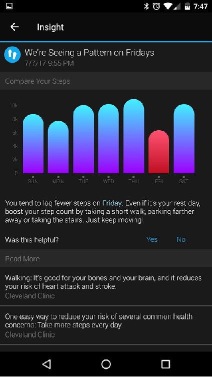
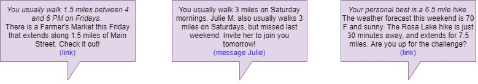

---
output:
  html_document: default
---
# A Fitness App That Takes Initiative! {#Meetup Fitness}

#### Keywords{-}

Fitness, App, Fitbit, Garmin, Step tracking

## Move More - But How?

In recent years, Americans have collectively been given the mandate to "be more active". We are constantly reminded that walking more helps combat heart disease, and that obesity is among the top killers in this country. In a genuine effort to change their habits, many people have purchased a fitness watch or other step counter. Companies such as Fitbit and Garmin offer fitness bands that promise [actionable insights](https://connect.garmin.com/en-US/features/insights) for users. However, these insights need significant improvement.

I have been wearing the Garmin Vivofit 3 fitness watch for the last 1 year. Below is a real screenshot of my Garmin Connect Insights page:

  

 
With 6 months of data on my walking, sleep, and activity, the insights that the app suggested were to "take the stairs" and "park further away". These were quite a disappointment: totally generic suggestions not tailored to me at all. They worked in the short term, but did not last very long as lifestyle changes. Eventually, the hassle of the stairs overruled my abstract desire to be "more fit", and I fell back to the lazy weekends that I enjoyed. 

I eventually did find the motivation to walk more, but it came from an unexpected place: I adopted a dog. My 1 year old puppy, Flick, needs *many* miles of walking every day, and I have been obliging. There are certainly times that I feel tired or lazy, but my desire to treat Flick well overrules my excuses. The trick, I have found, is that I am truly enjoying the walking. I enjoy working with my dog, and I love seeing the excitement from him. I genuinely look forward to our outings now, and it has kept me active throughout the summer and even now, into the dreary Seattle winter.

My failed attempt at fitness through Garmin and then my success with Flick brought a realization: successful fitness comes when  being active is made enjoyable. Here, my team proposes a fitness app that brings that approach to all users. We create helpful and specific suggestions by using data to transform the generic idea of "walking more" into personally targeted challenges. These challenges build a physical adventure to go alongside each user's fitness journey, and ultimately create long-lasting habits. 

## Using Your Data To Make Fitness Fun 

Our app is at the intersection of Fitbit and Meetup. It analyzes a user's movement statistics, then suggests activities and social groups to encourage the user to move more. For example, the app may offer suggestions like the ones below: 

  

The app works in three stages:  

1. By analyzing the user's fitness band data, the app characterizes habits, strengths, and struggles. It determines which days and times the user is most active, and which days see less movement. It also determines the user's physical capabilities: max speed, duration, and distance.  

2. The app then searches through a database of known activities and suggests those that fit the user. Activities of achievable duration and intensity are offered, alongside some of increased intensity (~10%) as a "challenge".  For example, a user that has completed a 3-mile hike every Saturday for the last month may be challenged to complete a nearby 4-mile hike, while a user with minimal activity history may see a suggestion for a 0.5-mile walking tour of the botanical gardens.  

3. Finally, the app searches the user's social network to find a suitable workout buddy. Friends with similar activity profiles (duration, distance, and frequency) are matched and offered an appropriate adventure for the pair to explore together.  

Eventually, the app's functionality could be expanded by offering suggested hobbies or excursions. This feature would consider the activities a user has logged regularly, and attempt to introduce a new hobby based on combinations seen in other users. For example, data analysis may reveal that 80% of users logging a hike every Saturday also log a snowshoeing trip at least once in December. An avid hiker would then be prompted with a suggestion in December - "Why not give showshoeing a try?" Perhaps a Groupon for a guided showshoeing adventure could accompany the suggestion.

In summary, the app suggests activities that strike the balance between achievability and challenge, and uses social networking to keep users on track with their goals.

## A Real Action Plan

Relentless marketing has finally begun to convince the American public that fitness is important, and that moving more each day is one key to remaining healthy. The fitness band market has grown incredibly, fueled by people who geuinely want to make a change to their lives. Those good intentions deserve to be met with an action plan. Our app promises to give that level of direction to the average person's fitness journey. It uses data science to find activities that would suit a user, and embraces social networking by using friends to encourage people to stick with their goals. Of course, no app can *promise* results. But this program brings together new elements that would certainly help the cause.
