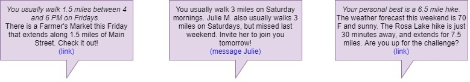

---
output:
  html_document: default
---
# A Fitness App That Takes Initiative! {#Meetup Fitness}

#### Keywords

Fitness, App, Fitbit, Garmin, Step tracking

## Move More - But How?

In recent years, Americans have collectively been given the mandate to "be more active". We are constantly reminded that walking more helps combat heart disease, and that obesity is among the top killers in this country. In a genuine effort to change their habits, many people have purchased a fitness watch or other step counter. Companies such as Fitbit and Garmin offer fitness bands that promise [actionable insights](https://connect.garmin.com/en-US/features/insights) for users. However, these insights need significant improvement.

  

Above is a real screenshot of a Garmin Connect Insight's page. The app suggests that I take the stairs and park further from my door in order to increase my activity on Fridays. These are fair suggestions if the goal is merely to increase step count. However, I don't anticipate those changes lasting very long with me; eventually, the hassle will outweigh the knoble goal of fitness.  

Consider now the average user of a fitness band. He is not a regular gym goer or a professional nutritionist; he is a working professional with a desk job and a fear of heart disease. He may embrace the suggestion to take the stairs at first. In fact, he may even travel down the slippery slope into more eclectic and ridiculous options like [yoga ball](https://officechairadvisor.com/yoga-ball-office-chair/) or [treadmill](https://www.thehumansolution.com/uplift-treadmill-desks/) office chairs. In the end, though, he will abandon all of that and return to his original, comfortable routine because it is what he enjoys.  

This scenario illustrates the current conundreum: (1) fitness band users are desperate to increase their activity levels, (2) they have no idea how to do it, and (3) current fitness apps are not offering helpful suggestions. To really change habits, an app must engage the user in the path to better fitness. He must genuinely be excited about taking on new activities! Here, an app is proposed that offers fitness band users a better way to achieve their step goals -- by leading them to adventures they will love.  

## Using Your Data To Make Fitness Fun 

The app proposed here will be at the intersection of Fitbit and Meetup. It will analyze a user's movement statistics, then suggest activities and social groups to encourage the user to move more.  

  

The app works in three stages:  

1. By analyzing the user's fitness band data, the app characterizes habits, strengths, and struggles. It determines which days and times the user is most active, and which days have grown more inactive. It also determines the user's physical capabilities: max speed, duration, and distance.  

2. The app then searches through a database of known activities and suggests those that fit the user. Activities of a similar duration and intensity are offered, alongside some of increased intensity (~10%) as a "challenge".  For example, a user that has completed a 3-mile hike every Saturday for the last month may be challenged to complete a nearby 4-mile hike, while a user with minimal activity history may see a suggestion for a 0.5-mile walking tour of the botanical gardens.  

3. Finally, the app searches the user's social network to find a suitable workout buddy. Friends with similar activity profiles (duration, distance, and frequency) are matched and offered an appropriate adventure for the pair to explore together.  

Eventually, the app's functionality could be expanded by offering suggested hobbies or excursions. This feature would consider the activities a user has logged regularly, and attempt to introduce a new hobby based on combinations seen in other users. For example, data analysis may reveal that 80% of users logging a hike every Saturday also log a snowshoeing trip at least once in December. An avid hiker would then be prompted with a suggestion in December - "Why not give showshoeing a try?" Perhaps a Groupon for a guided showshoeing adventure could accompany the suggestion.

## A Real Action Plan

Relentless marketing has finally begun to convince the American public that fitness is important, and that moving more each day is one key to remaining healthy. The fitness band market has grown incredibly, fueled by people who geuinely want to make a change to their lives. Those good intentions deserve to be met with an action plan. The app discussed here promises to give that level of direction to the average person's fitness journey. It uses data science to find activities that would suit a user, and embraces social networking by using friends to encourage people to stick with their goals. Of course, no app can *promise* results. But this program brings together new elements that would certainly help the cause.
