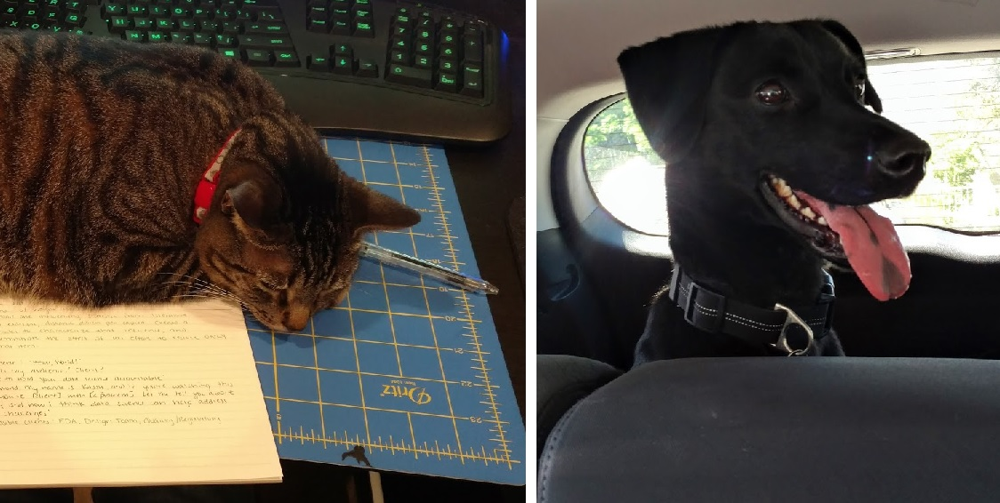

<!-- This won't be displayed but it will initialize your R session. Add any R libraries you need here. -->
```{r init,include=FALSE,echo=FALSE}
library(magrittr)
```


# Welcome!{-}

<!-- Below this line is just examples of how you can embed video from Google Drive. First you have to enable sharing, then just get the object ID which is that long string between d/ and /preview and will also be appended to any sharing link you generate for your video. -->
<p>
```{r hello-benji,echo=FALSE,fig.cap='Hello Benjamin Franklin!',fig.align='center'}
knitr::include_url('https://drive.google.com/file/d/0B6bobRDQR96iVEV3SXJJal9CczQ/preview')
```

### Abstract: A Fitness App That Takes Initiative{-}

Fitness band companies such as Fitbit or Garmin promise to offer "actionable insights" that help users be more active. However, they have not delivered on that promise. Currently, the best advice available to the average app user is to "take the stairs" and "walk more". That is no way to inspire lasting life change. Instead, apps must work with each user as an individual and find activities that bring enjoyment on a personal level. This project describes an app that does exactly that: we use movement data to understand a user's habits and abilities, then offer suggestions for fun, enjoyable, and most importantly sustainable activities. With an element of social networking added for accountability, this app is sure to inspire many people in their fitness journey.  

### Abstract: Data-driven Team Selection in Youth Basketball{-}

Youth basketbal league coordinators are ill equipped for the challenge of creating balanced teams each season. With players changing every year and many dramatically changing in skill level, the youth sports draft problem is even more complicated than professional team formation. This project aims to bring professional-level sports analytics to the youth level, so that coordinators can create better games, balanced seasons, and ultimately more lifelong athletes.
  
## About the author{-}

Krissy Gianforte is currently a student in the UC Berkeley MIDS Program. She is interested in statistics and data analysis as it relates to her career in medical device development and testing. She lives in Washington state with her husband, dog, and cat. They enjoy  hiking and backpacking around western Washington. Except for the cat, who prefers to stay home and help with RDADA assignments. 




*Updated: `r Sys.Date()`*
